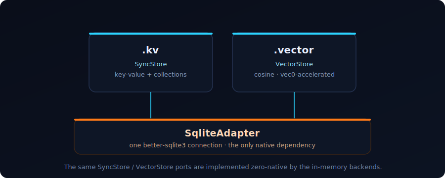
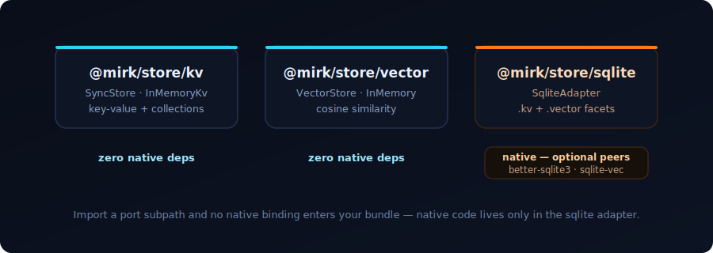

<p align="center">
  
</p>

# mirk

> **Ports you import. Adapters you choose.** The dark foundational layer of storage — key-value, collections, vector search, full-text search, graph traversal, and authored-data fixtures as code-split primitives with no domain baked in.

   

## What is this?

Most apps reach for one of two things when they need to store something. A **full database** — and
inherit a server, a daemon, an async API, and a native dependency in the client bundle they never
asked for. Or a **pile of single-purpose libraries** — each with its own idioms, its own
connection, repeated once per capability.

**mirk** is the layer underneath both: small, typed, durable primitives with no domain
baked in — somewhere to put key-values and collections, somewhere to put vectors, full-text search,
graph edges, and authored fixture packs with validation/provenance. You assemble them from clean
**interface ports** and swappable **source adapters**. Build against an in-memory reference with
nothing installed; swap in SQLite for persistence without changing a line of your own code.

A blog, a game, or an agent host can all draw from the same foundation. Published under the
`@mirk/*` scope.

## One source, many capabilities

A *source adapter* opens **one** backend connection and serves several capability **facets** over
it. `SqliteAdapter` is a single `better-sqlite3` database exposing `.kv` (`SyncStore`), `.vector`
(`VectorStore`), and `.search` (`SearchStore`) facets — not three libraries, three connections,
and three transaction scopes.

<p align="center">
  
</p>

The facets implement the same `SyncStore` / `VectorStore` / `SearchStore` ports that the
zero-native in-memory backends do — so you can build and test against memory, then drop in the
SQLite adapter for the real thing.

## Code-split — import only what you need

Each capability is its own subpath. The **ports** and their in-memory references are native-free;
native bindings appear in exactly one place — the SQLite adapter — as **optional peer
dependencies**. Import `@mirk/store/kv` or `/vector` and no binding enters your bundle.

<p align="center">
  
</p>

| Import | What you get | Native deps |
|---|---|---|
| `@mirk/store` | the ports, their in-memory references, `toAsync`, cosine helpers | none |
| `@mirk/store/kv` | `SyncStore` port (key-value + collections) · `InMemoryKv` · `toAsync` | none |
| `@mirk/store/vector` | `VectorStore` port · `InMemoryVectorStore` · cosine helpers | none |
| `@mirk/store/search` | `SearchStore` port · `InMemorySearchStore` · BM25-style keyword search | none |
| `@mirk/store/graph` | graph helpers over the collection port (`neighbors`, `traverse`, frontier-batched traversal) | none |
| `@mirk/store/sqlite` | the SQLite source adapter — one connection, `.kv` + `.vector` + `.search` facets | `better-sqlite3` (peer) · `sqlite-vec` (optional peer) |
| `@mirk/fixtures` | typed authored-data loader, registry, refs, diagnostics, provenance | none |

## Sync by design

Embedded backends are **synchronous** — `better-sqlite3` is, and an async-everywhere interface
taxes every local call with a Promise it doesn't need. A `SyncStore` lifts to an async API via
`toAsync(store)`; the reverse is impossible. Pick sync for embedded and local; reach for async only
where a remote backend genuinely requires it.

## Install

```bash
npm install @mirk/store
# Using @mirk/store/sqlite? Add its peer:
npm install better-sqlite3
# Optional: vec0 KNN acceleration (graceful exact-JS fallback without it)
npm install sqlite-vec
```

ESM-only. Node ≥ 20.

## A taste

```ts
// Zero native deps — build against the in-memory reference.
import { InMemoryKv, toAsync } from "@mirk/store/kv";

const kv = new InMemoryKv();
kv.set("user:1", { name: "Ada" });
kv.get<{ name: string }>("user:1");   // { name: "Ada" }

const remote = toAsync(kv);            // same surface, Promises (sync ⊂ async)
await remote.get("user:1");
```

```ts
// One SQLite connection, three capability facets over it.
import { SqliteAdapter } from "@mirk/store/sqlite";

const db = new SqliteAdapter({ path: "data.db" });

db.kv.set("user:1", { name: "Ada" });               // key-value + collections

db.search.index("pages", { id: "intro", fields: { title: "Intro", body: "hello world" } });
db.search.search("pages", "hello", { fieldWeights: { title: 4, body: 1 } });

const embedding = new Float32Array(768);            // your real embedding; dimensions infer on first write
db.vector.upsert("docs", { id: "a", vector: embedding });
db.vector.search("docs", query, { topK: 10 });      // ranked by cosine

db.close();
```

Vectors rank by **exact cosine**; install the optional `sqlite-vec` peer and the same search is
transparently vec0-accelerated, with identical rankings. Full API in
[`packages/store/README.md`](packages/store/README.md).

## Design

- **Ports vs source adapters.** Interfaces and in-memory references stay native-free; source
  adapters implement one or more ports over a single connection and are the only place native
  bindings appear.
- **No barrels.** `export *` is forbidden; every entry declares explicit named re-exports.
- **Optional-peer native deps**, referenced solely from the sqlite adapter.
- **Backend parity.** The in-memory reference and the sqlite adapter must behave identically —
  ordering, tie-breaks, null/zero handling. Cross-backend parity tests are the contract.

## Develop

```bash
pnpm install
pnpm build      # tsup, per package
pnpm test       # vitest — real backends, real persistence, real assertions
pnpm -r typecheck
```

## Release

Mirk uses Changesets for release bookkeeping:

```bash
pnpm changeset          # describe package-impacting changes
pnpm version-packages   # apply versions from pending changesets
pnpm release            # build, then changeset publish
```

Do not hand-bump package versions for future releases; add a changeset and let `pnpm version-packages` apply it.

## Status

Pre-1.0. The public API should be considered unstable until the first tagged release.

Roadmap: [`docs/roadmap.md`](docs/roadmap.md). The `@mirk/fixtures` authored-data primitive spec
lives at [`docs/fixtures-spec.md`](docs/fixtures-spec.md), with the package README at
[`packages/fixtures/README.md`](packages/fixtures/README.md).

## License

Apache-2.0 © David Robinson. See [LICENSE](LICENSE).
