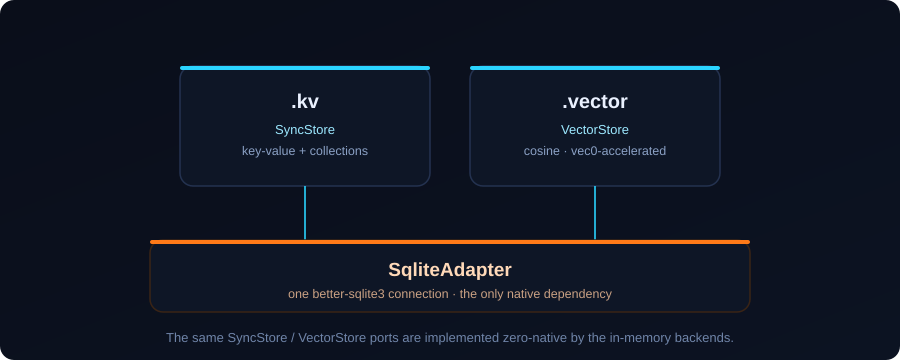
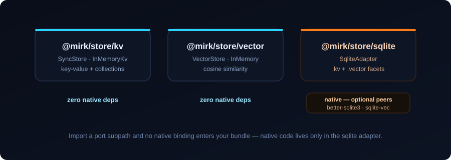

<p align="center">
  
</p>

# mirk

> **Ports you import. Adapters you choose.** The dark foundational layer of storage — key-value, collections, vector search, full-text search, graph traversal, and authored-data fixtures as code-split primitives with no domain baked in.

   

## What is this?

Most apps reach for one of two things when they need to store something. A **full database** — and
inherit a server, a daemon, an async API, and a native dependency in the client bundle they never
asked for. Or a **pile of single-purpose libraries** — each with its own idioms, its own
connection, repeated once per capability.

**mirk** is the layer underneath both: small, typed, durable primitives with no domain
baked in — somewhere to put key-values and collections, somewhere to put vectors, full-text search,
graph edges, and authored fixture packs with validation/provenance. You assemble them from clean
**interface ports** and swappable **source adapters**. Build against an in-memory reference with
nothing installed; swap in SQLite for persistence without changing a line of your own code.

A blog, a game, or an agent host can all draw from the same foundation. Packages use the
`@mirk/*` scope.

## One source, many capabilities

A _source adapter_ opens **one** backend connection and serves several capability **facets** over
it. `SqliteAdapter` is a single `better-sqlite3` database exposing `.kv` (`SyncStore`), `.vector`
(`VectorStore`), and `.search` (`SearchStore`) facets — not three libraries, three connections,
and three transaction scopes.

<p align="center">
  
</p>

The facets implement the same `SyncStore` / `VectorStore` / `SearchStore` ports that the
zero-native in-memory backends do — so you can build and test against memory, then drop in the
SQLite adapter for the real thing.

## Code-split — import only what you need

Each capability is its own subpath. The **ports** and their in-memory references are native-free;
native bindings appear in exactly one place — the SQLite adapter — as **optional peer
dependencies**. Import `@mirk/store/kv` or `/vector` and no binding enters your bundle.

<p align="center">
  
</p>

| Import                   | What you get                                                                                                                                                      | Native deps                                                                       |
| ------------------------ | ----------------------------------------------------------------------------------------------------------------------------------------------------------------- | --------------------------------------------------------------------------------- |
| `@mirk/store`            | the ports, their in-memory references, sync-to-async lifts, cosine helpers                                                                                        | none                                                                              |
| `@mirk/store/kv`         | `SyncStore` port (key-value + collections) · `InMemoryKv` · `toAsync`                                                                                             | none                                                                              |
| `@mirk/store/atomic`     | optional versioned reads, declarative atomic mutations, idempotent receipts, and capability guards                                                                | none                                                                              |
| `@mirk/store/vector`     | `VectorStore` port · `InMemoryVectorStore` · cosine helpers                                                                                                       | none                                                                              |
| `@mirk/store/search`     | `SearchStore` port · `InMemorySearchStore` · BM25-style keyword search                                                                                            | none                                                                              |
| `@mirk/store/graph`      | graph helpers over the collection port (`neighbors`, `traverse`, frontier-batched traversal)                                                                      | none                                                                              |
| `@mirk/store/sql`        | SQL adapter contract types                                                                                                                                        | none                                                                              |
| `@mirk/store/sqlite`     | the SQLite source adapter — one connection, `.kv` + `.vector` + `.search` facets                                                                                  | `better-sqlite3` (peer) · `sqlite-vec` (optional peer)                            |
| `@mirk/store-libsql`     | async libSQL/Turso source adapter — one client, `.kv` + `.vector` facets                                                                                          | none                                                                              |
| `@mirk/store-postgres`   | async PostgreSQL source adapter — one pool, `.kv` collections with JSONB filters                                                                                  | `pg`                                                                              |
| `@mirk/store-markdown`   | synchronous Markdown + YAML-headmatter store adapter with derived indexes and optional git history                                                                | none                                                                              |
| `@mirk/fixtures`         | typed authored-data loader, registry, refs, diagnostics, provenance, and the explicit-config `mirk-fixtures` CLI                                                  | none                                                                              |
| `@mirk/artifact`         | durable artifact metadata, integrity, lineage, atomic finalization, object leases, and plan-first maintenance                                                     | none                                                                              |
| `@mirk/artifact-opendal` | OpenDAL-backed implementation of the artifact object-storage port                                                                                                 | `opendal` (peer)                                                                  |
| `@mirk/statements`       | specialized SQLite storage for statement revisions, admission receipts, bitemporal indexes, and dual-read parity harnesses; it does not widen general store ports | `better-sqlite3` (peer)                                                           |
| `@mirk/surreal`          | separately imported async store, graph, vector, search-gate, object-storage, Node, and browser WASM adapters over one shared connection                           | `@surrealdb/node` / `@surrealdb/wasm` optional peers for their dedicated subpaths |
| `@mirk/migrate`          | backend-neutral checkpointed migration across Mirk ports and caller manifests                                                                                     | none                                                                              |

## The same ports in Python

`python/store` (`mirk-store`) is a second implementation of the KV, collection, vector, search and
graph ports, over stdlib `sqlite3` with zero runtime dependencies. It opens SQLite files
TypeScript wrote and writes files TypeScript reads. Neither language is the other's reference:
both replay one generated corpus at [`conformance/`](conformance/README.md), the generator refuses
to emit a scenario the in-memory reference and the SQLite adapter disagree on, and each runner
executes every scenario on both of its backends with no skips permitted. `pnpm conformance:current`
regenerates into a temporary tree and diffs, so a hand-edited or stale corpus fails a release
receipt rather than riding along inside one.

## Sync by design

Embedded backends are **synchronous** — `better-sqlite3` is, and an async-everywhere interface
taxes every local call with a Promise it doesn't need. A `SyncStore` lifts to an async API via
`toAsync(store)`; the reverse is impossible. Pick sync for embedded and local; reach for async only
where a remote backend genuinely requires it.

## Install

```bash
npm install @mirk/store
# Using @mirk/store/sqlite? Add its peer:
npm install better-sqlite3
# Optional: vec0 KNN acceleration (graceful exact-JS fallback without it)
npm install sqlite-vec
```

ESM-only. Node ≥ 20.

For a remote or embedded async SurrealDB source, install `@mirk/surreal` and compose only the
adapter subpaths you need over one `SurrealConnection`. The package currently ships store, graph,
vector, object-storage, owned Node embedded, and browser WASM in-memory support. Weighted
multi-field search and persistent WASM `indxdb://` remain explicit unsupported gates rather than
compatibility shims.

**IndexedDB status:** published `@surrealdb/wasm` versions 3.0.0–3.0.3 contain a confirmed upstream
transaction bug that breaks `indxdb://` when selecting a namespace/database. SurrealDB tracks the
failure in [surrealdb.js#571](https://github.com/surrealdb/surrealdb.js/issues/571) and merged the
IndxDB 0.12 fix in [surrealdb.js#600](https://github.com/surrealdb/surrealdb.js/pull/600), but the
fixed WASM package has not yet been published. Mirk supports WASM `mem://` now and will enable
`indxdb://` only after the fixed release passes its browser write/reopen/read test.

For PostgreSQL, install `@mirk/store-postgres`. It implements the async KV and collection ports over
one owned or caller-provided `pg.Pool`; future search and vector facets will share the same pool.

## A taste

```ts
// Zero native deps — build against the in-memory reference.
import { InMemoryKv, toAsync } from "@mirk/store/kv";

const kv = new InMemoryKv();
kv.set("user:1", { name: "Ada" });
kv.get<{ name: string }>("user:1"); // { name: "Ada" }

const remote = toAsync(kv); // same surface, Promises (sync ⊂ async)
await remote.get("user:1");
```

```ts
// One SQLite connection, three capability facets over it.
import { SqliteAdapter } from "@mirk/store/sqlite";

const db = new SqliteAdapter({ path: "data.db" });

db.kv.set("user:1", { name: "Ada" }); // key-value + collections

db.search.index("pages", {
  id: "intro",
  fields: { title: "Intro", body: "hello world" },
});
db.search.search("pages", "hello", { fieldWeights: { title: 4, body: 1 } });

const embedding = new Float32Array(768); // your real embedding; dimensions infer on first write
const query = new Float32Array(768);
db.vector.upsert("docs", { id: "a", vector: embedding });
db.vector.search("docs", query, { topK: 10 }); // ranked by cosine

db.close();
```

Vectors rank by **exact cosine**; install the optional `sqlite-vec` peer and the same search is
transparently vec0-accelerated, with identical rankings. Full API in
[`packages/store/README.md`](packages/store/README.md).

## Design

- **Ports vs source adapters.** Interfaces and in-memory references stay native-free; source
  adapters implement one or more ports over a single connection and are the only place native
  bindings appear.
- **No barrels.** `export *` is forbidden; every entry declares explicit named re-exports.
- **Optional-peer native deps**, referenced solely from the sqlite adapter.
- **Backend parity.** The in-memory reference and the sqlite adapter must behave identically —
  ordering, tie-breaks, null/zero handling. Cross-backend parity tests are the contract.

## Develop

```bash
pnpm install
pnpm build      # tsup, per package
pnpm test       # vitest — real backends, real persistence, real assertions
pnpm -r typecheck
```

## Release

Mirk uses Changesets for release bookkeeping:

```bash
pnpm changeset          # describe package-impacting changes
pnpm version-packages   # apply versions from pending changesets
pnpm release            # build, then changeset publish
pnpm release:verify -- --all   # package-owned tarball/export/install evidence
pnpm release:receipt -- --all  # same evidence, requiring a clean source tree
```

Do not hand-bump package versions for future releases; add a changeset and let `pnpm version-packages` apply it.
Release receipts are build evidence. They do not by themselves prove registry publication or consumer/runtime adoption.

## Status

Pre-1.0. Mirk uses the following evidence vocabulary. These are separate states, not synonyms:

| State | Evidence required | Does not establish |
| --- | --- | --- |
| `implemented` | Source and package contract evidence exist in the current checkout. | A release, registry publication, or consumer use. |
| `receipt-green` | A clean `mirk-release-receipt/v1` names the source commit and passes build, test, typecheck, pack, export, boundary, and temporary-consumer checks. | Registry publication, remote merge, or downstream adoption. |
| `Verdaccio-published` | The named version resolves from the canonical local Verdaccio registry. | Public npm publication or provenance from a particular commit. |
| `public-npm-published` | The named version resolves from `https://registry.npmjs.org`. | Consumer installation or runtime use. |
| `remote/tagged` | The source commit is present in the intended remote ref and has an explicit release tag where required. | Registry publication or consumer use. |
| `consumer-installed` | A consumer's frozen lockfile and clean install resolve the named package train. | Relevant behavior or deployment. |
| `consumer-adopted` | Consumer source exercises the package and its relevant tests or smoke path pass. | Public release or deployment. |
| `runtime/deployment-proven` | A real runtime or deployed user path exercises the package. | Nothing beyond that path. |

Use this evidence order when describing a release: current source → commit-bound receipt →
remote/tag → named registry → consumer install/adoption → runtime or deployment. A later state
never upgrades an earlier one implicitly. In particular, a Verdaccio package is not a public npm
package, and a green receipt is not a publication receipt.

Current closure evidence (2026-08-12):

- `implemented` and `receipt-green`: 9 of the 10 current `@mirk/*` packages have clean receipts
  from `07cb48e` (`pnpm release:receipt --all`), tracked in
  [`docs/evidence/receipts/2026-08-12/`](docs/evidence/receipts/2026-08-12/). Each receipt records
  the number of tests the package actually executed. `@mirk/store-postgres` has no receipt at this
  commit: its whole suite skips without `MIRK_POSTGRES_TEST_URL`, and publication mode refuses a
  receipt for a run that executed zero tests. CI supplies that URL.
- `Verdaccio-published`: the current package train is present in the canonical local registry.
  This metadata is not tied to `07cb48e` by a publication receipt.
- `remote/tagged`: `07cb48e` is pushed to `origin/main`; no tag points at it yet.
- `consumer-adopted`: `templates/sigil-chat` installs the current train from its frozen lockfile
  and exercises Mirk-backed store, fixture, Markdown, and artifact paths. Consumer evidence stays
  with that product; Mirk does not maintain a cross-project conformance matrix.
- `public-npm-published` and `runtime/deployment-proven`: not claimed for this train.

Roadmap: [`docs/roadmap.md`](docs/roadmap.md). The `@mirk/fixtures` authored-data primitive spec
lives at [`docs/fixtures-spec.md`](docs/fixtures-spec.md), with the package README at
[`packages/fixtures/README.md`](packages/fixtures/README.md). The durable artifact substrate is
implemented in [`packages/artifact`](packages/artifact), with its ownership and failure contract in
[`docs/artifact-spec.md`](docs/artifact-spec.md).
The PostgreSQL adapter contract is documented in
[`docs/store-postgres-spec.md`](docs/store-postgres-spec.md).
Release history: [`CHANGELOG.md`](CHANGELOG.md).

## License

Apache-2.0. See [LICENSE](LICENSE).
