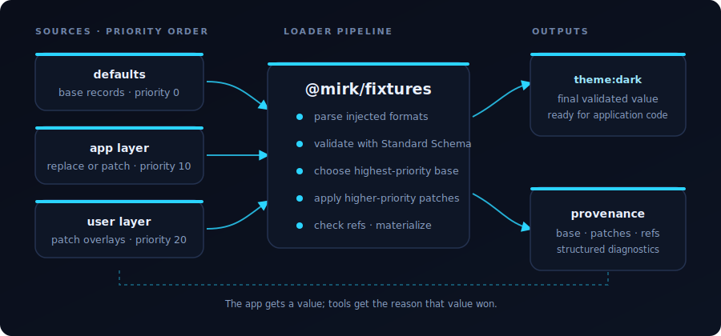
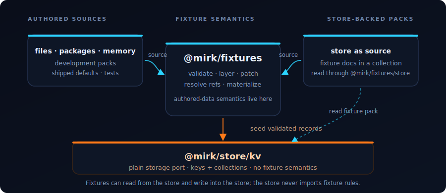

# @mirk/fixtures

> Typed, layered, explainable authored data.

   

## Why this exists

Applications do not only run code. They also run authored data: defaults, templates, themes,
configuration fragments, lookup tables, prompts, content packs, test fixtures.

Reading that data is easy. Trusting it is the hard part.

Once authored data matters, the same questions come up repeatedly:

- What shape is this record supposed to have?
- Which source wins when defaults, app overrides, and user overrides all define the same id?
- Can an override patch one field, or does it need to copy the whole object?
- Do references point at records that exist?
- Can a CLI or UI explain where the final value came from?
- Can the same pack be loaded from files in development, bundled defaults in a package, and durable
  store records in production?

`@mirk/fixtures` turns authored data into something load-bearing: validated records, deterministic
precedence, small patch overlays, checked references, and provenance.

## The contract

A fixture is addressed by a stable ref:

```txt
theme:dark
template:welcome
prompt:code-review
```

A fixture type defines where records live and how they are validated:

```ts
import { createFixtureLoader, createFixtureRegistry, defineFixtureType } from "@mirk/fixtures";
import { createMemoryFixtureSource } from "@mirk/fixtures/memory";

const themeType = defineFixtureType({
  type: "theme",
  directory: "themes",
  schema: ThemeSchema,
  mergeStrategy: "deep",
});

const registry = createFixtureRegistry();
registry.register(themeType);

const defaults = createMemoryFixtureSource({
  id: "defaults",
  files: {
    "themes/dark.json": JSON.stringify({
      colors: { background: "#050507", foreground: "#f4f4f5" },
    }),
  },
});

const loader = createFixtureLoader({ registry, sources: [defaults] });
const dark = await loader.load("theme:dark");
```

Schemas use the Standard Schema v1 contract. The package does not choose Zod, Valibot, ArkType, or
any other validator for you.

Parsers are injected. JSON is built in; YAML, JSON5, TOML, or custom formats are caller choices, not
root-package bundle tax.

## Layers and patches

Authored data usually has more than one layer:

```ts
const loader = createFixtureLoader({
  registry,
  sources: [
    { source: defaults, layer: "base", priority: 0 },
    { source: app, layer: "app", priority: 10 },
    { source: user, layer: "user", priority: 20 },
  ],
});
```

Higher-priority base records replace lower-priority base records. Higher-priority patch documents can
modify only the fields they own:

```json
{
  "$patch": "theme:dark",
  "colors": {
    "accent": "#8b5cf6"
  }
}
```

The result is deterministic, and the loader records provenance:

```txt
theme:dark
  base   defaults/themes/dark.json
  patch  app/themes/dark.json
  patch  user/themes/dark.json
```

<p align="center">
  
</p>

Application code gets the final value. Tools get the reason that value won.

## References

Fixtures can refer to other fixtures explicitly:

```json
{
  "title": "Welcome",
  "theme": { "$ref": "theme:dark" }
}
```

Explicit `$ref` objects are the default. Bare string refs are opt-in so prose-heavy records do not
accidentally become reference graphs.

The loader can validate references and build a graph:

```ts
const report = await loader.validate();
const graph = await loader.referenceGraph();
```

Missing targets become diagnostics and unresolved graph nodes, not late runtime surprises.

## Sources

The loader works over a small source interface: list entries, read entry. Source helpers adapt the
places authored data commonly lives.

| Source | Use it for | Status |
| --- | --- | --- |
| `@mirk/fixtures/memory` | tests, examples, generated packs | implemented |
| `@mirk/fixtures/store` | durable packs backed by `@mirk/store/kv` | implemented |
| `@mirk/fixtures/filesystem` | local directories and CLI workflows | planned |
| `@mirk/fixtures/package` | defaults shipped with a package | planned |

Everything above the source boundary is shared: parsing, validation, layering, patching, reference
resolution, materialization, diagnostics, and provenance.

## Store integration

Use `@mirk/fixtures/store` when authored data needs to cross the storage boundary:

- **source:** read fixture documents from a store collection;
- **sink:** seed validated fixture values into ordinary store collections.

<p align="center">
  
</p>

### Store as source

Fixture documents can live in a store collection:

```ts
import { createStoreFixtureSource } from "@mirk/fixtures/store";

const source = createStoreFixtureSource({
  id: "db",
  store: adapter.kv,
  collection: "fixtures",
});
```

The loader still validates, layers, patches, and explains them like any other source.

### Store as sink

Validated fixtures can seed ordinary store collections:

```ts
import { seedStoreFromFixtures } from "@mirk/fixtures/store";

await seedStoreFromFixtures({
  loader,
  store: adapter.kv,
  targets: {
    theme: "themes",
    template: "templates",
  },
  mode: "upsert",
});
```

The store package stays focused on storage ports. Fixture rules live here.

## Code-split imports

Root imports stay dependency-light and runtime-neutral.

| Import | What you get | Node-only modules | Status |
| --- | --- | --- | --- |
| `@mirk/fixtures` | registry, type definitions, loader, refs, diagnostics | no | implemented |
| `@mirk/fixtures/memory` | in-memory source | no | implemented |
| `@mirk/fixtures/store` | store source and seeding helpers | no | implemented |
| `@mirk/fixtures/filesystem` | filesystem source | yes | planned |
| `@mirk/fixtures/package` | package/resource source | maybe | planned |
| `@mirk/fixtures/cli` | CLI helpers | yes | planned |

The root entry does not pull filesystem APIs, parser bundles, database bindings, or CLI code into a
browser or edge bundle.

## What to care about

Judge the package by a small set of promises:

1. **No hidden precedence.** Layer order is explicit and deterministic.
2. **No unvalidated data.** Fixture values pass through schemas before use or seeding.
3. **No copy-the-world overrides.** Patch documents let higher layers own small changes.
4. **No mystery refs.** References can be checked and graphed.
5. **No unexplainable final values.** Provenance is part of the model.
6. **No backend lock-in.** The same loader works over memory, files, package resources, and store
   collections.
7. **No storage coupling.** Fixture rules stay in this package; store adapters stay plain.

## What this is not

`@mirk/fixtures` is not a database, a schema library, a parser bundle, a hot-reload service, a
migration engine, or a domain framework.

It is the reusable boundary between raw authored data and application state.

## Status

Draft specification. Not yet published.

See [`../../docs/fixtures-spec.md`](../../docs/fixtures-spec.md) for the detailed design.
